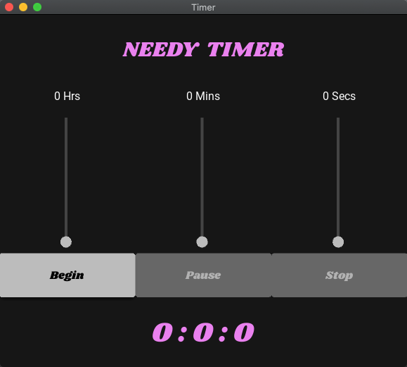

## Welcome!
---  

This marks the beginning for me in building a coding portfolio for recruiters.

The first (official) project, a timer, which I can use for timeboxing and being productive. 
It's version 2.0 because I built a very basic command-line version with limited functionality.
This is a GUI version with more advanced features. 

## Requirements ⚙️
---  
- Python (version 3.10.7)

## Dependencies 🛠️
--- 
- Kivy (version 2.3.0)
- Kivymd (version 1.1.1)

## Installation on Mac 🚀
---  
Clone the repository: `git clone https://github.com/TimWebberAU/Timer2.0.git`
Change into the project directory: `cd ~/"path/to/"Timer2.0`
Set up a virtual environment: `python3 -m venv timervenv`
Activate virtual environment: `source timervenv/bin/activate`
Install dependencies: `pip3 install -r requirements.txt`
Run program: `python3 appmanager.py`
  
Enjoy!

## Screenshots of Final Product
---  

---

---  

## LESSONS LEARNT 🎓
---
- I had a plan, going in, to build a loosely coupled program. This is what I was taught at Uni as the best practise. As you can see from my original UML below, I was going to achieve this loose coupling by separating all potential volatilities into different classes/components. However, Kivy and KivyMD, the modules used for creating a GUI, are naturally highly coupled. Because all of the widgets used to display anything on the screen are in the .kv file which the main app completely depends on. I was going to attempt to separate some timer logic into a separate class but then realised for a simple app like this it would be creating unnecessary complexity. Further, I would potentially have to create more dependencies with the new class objects regularly updating the GUI.
- I feel as though I have learnt or relearnt a lot during this project!

---
---  
## ORIGINAL PLANNING PHASE:
---  

### Objectives:
- Core use cases
- Requirements
- Volatility-based decomposition
- Component UML
- Build
  

### Core Use Cases:
- Accurate countdown timer
- Ability to set the time to any reasonable value
- Ability to pause/play the timer
- Ability to stop/reset the timer
  

### Requirements:
- Simple design, easy to use
- Small design, able to sit on a desktop, discreetly in one corner
- Useable on any system as an app?
  

### Volatilities:
- The menu: The style or elements may be changed at any time for any reason
- The background: An ability to change the background might be nice
- User input: Will need to be controlled and exceptions allowed for
- Clients host machine: Will this app be used on multiple operating systems?
- The GUI method used
- The way the timer is displayed

## Final UML
---  

## Original UML - Please see above for lessons learnt.
---  

NOTES on original UML
- Reconsider the relationships in the UML - if the GUI "has" a background, then doesn't that mean the GUI is "composed of" a background object?
